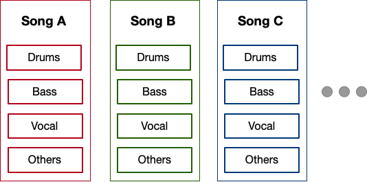
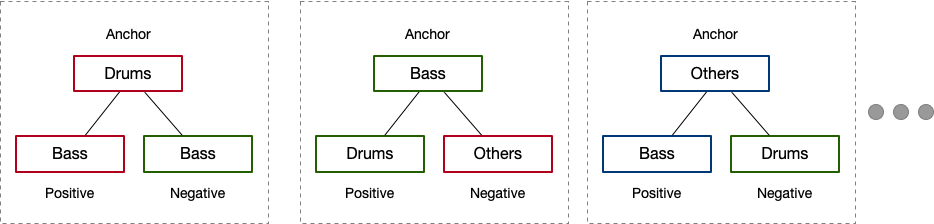

# Loop Compatibility Assessment
Which pair of loops sounds well TOGETHER?  

If you are a DJ or an electronic music producer, it is one of the essential tasks for you to choose the most fitting loops from the collection of loops you have, i.e., selecting loops that sound well together with what you have composed already. 

This repository is an attempt to automate this task: to evaluate how well two given loops sound together. 

## Dataset

We created a custom dataset of multitrack music by following the steps described below:

1. scraped [tens of thousands of music data from YouTube](https://github.com/keunwoochoi/YouTube-music-video-5M)
2. extract 2-bar-long loops using [loop-extractor repo](https://github.com/jblsmith/loopextractor)
3. [time-stretch all loops](https://pypi.org/project/pyrubberband/) to 4.0 seconds, i.e, <2 bar = 8 beats in 4 seconds> means all loops are in 120 bpm. 
4. split loops into drum/bass/vocal/other tracks using [open-umix](https://sigsep.github.io/open-unmix/)


<center></center>

## Model

We have tested CNN-based Siamese networks trained with Triplet Loss. 
To create triplet samples, we chose a random track from the entire loop dataset as an anchor, and randomly selected another loop from the same song as a positive sample, one more loop from a different song as a negative sample.  

<center></center>


# References 

We got the core inspiration from the following paper, especially in terms of dataset generation.  
```Chen, B.-Y., Smith, J. B. L. and Yang, Y.-H. (2020) ‘Neural Loop Combiner: Neural Network Models for Assessing the Compatibility of Loops’. Available at: http://arxiv.org/abs/2008.02011 (Accessed: 30 June 2021).```

